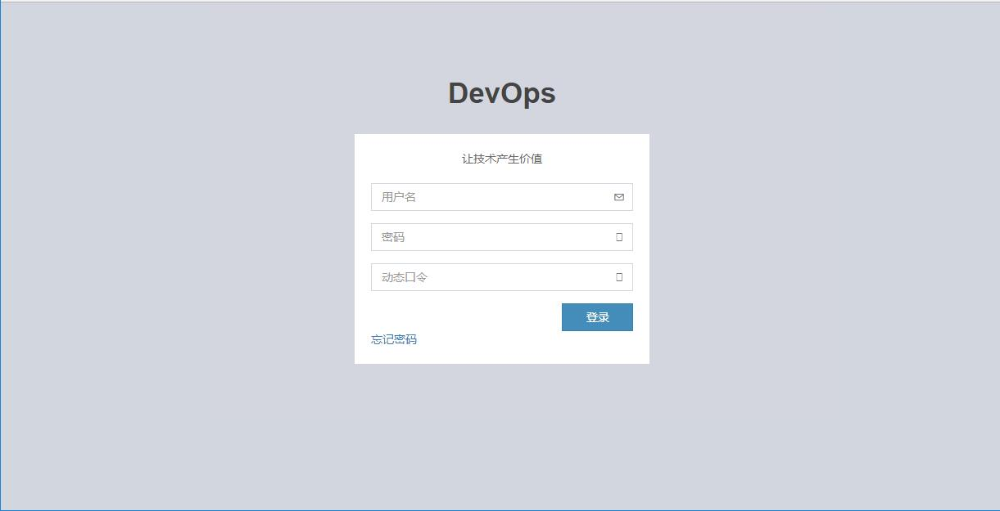
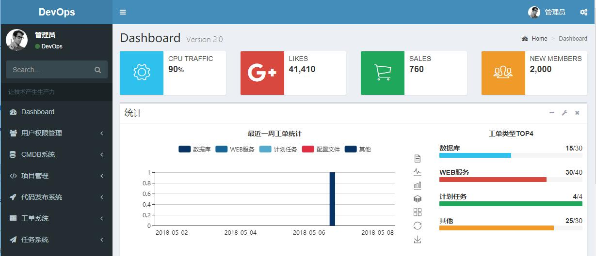
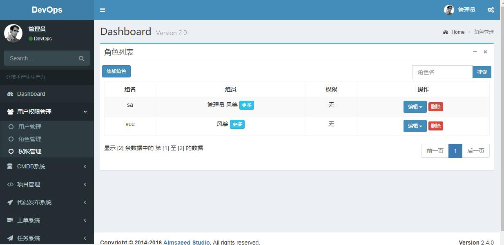
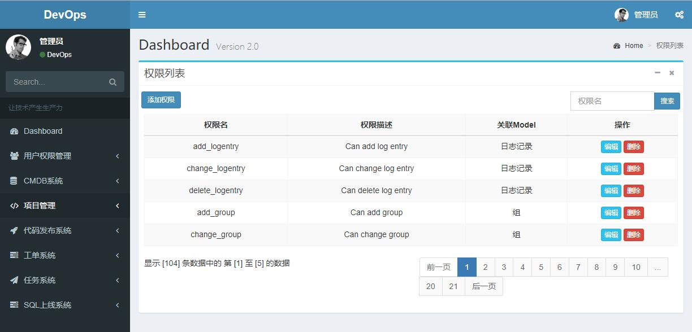
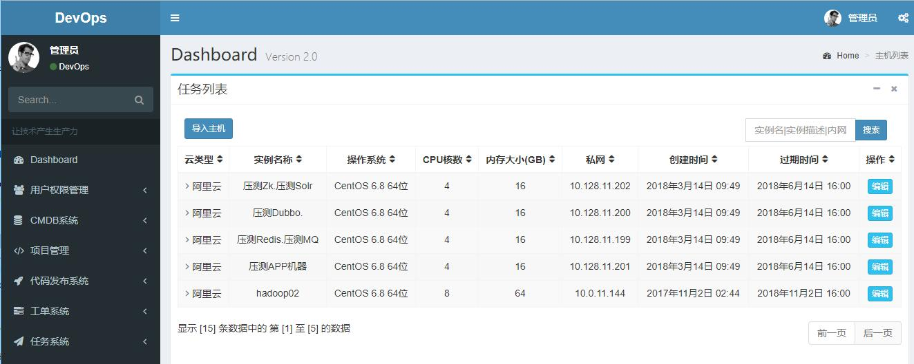
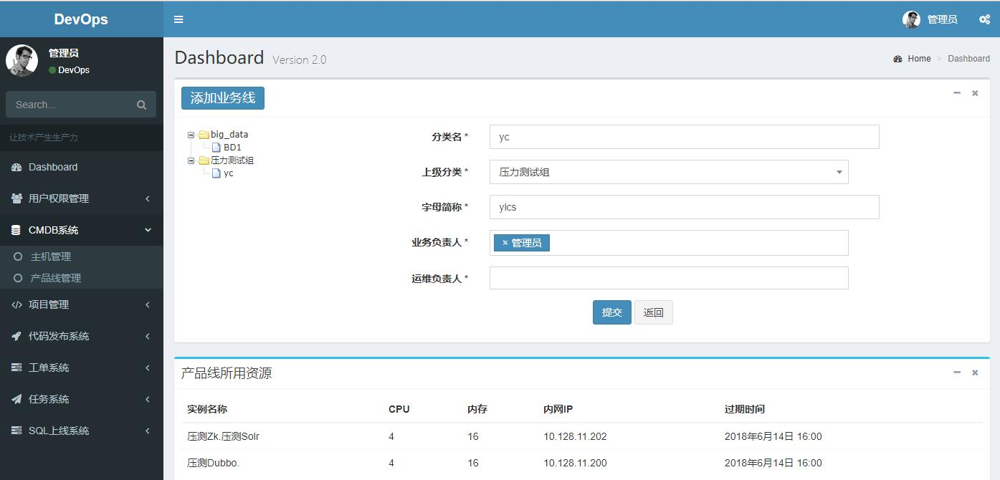
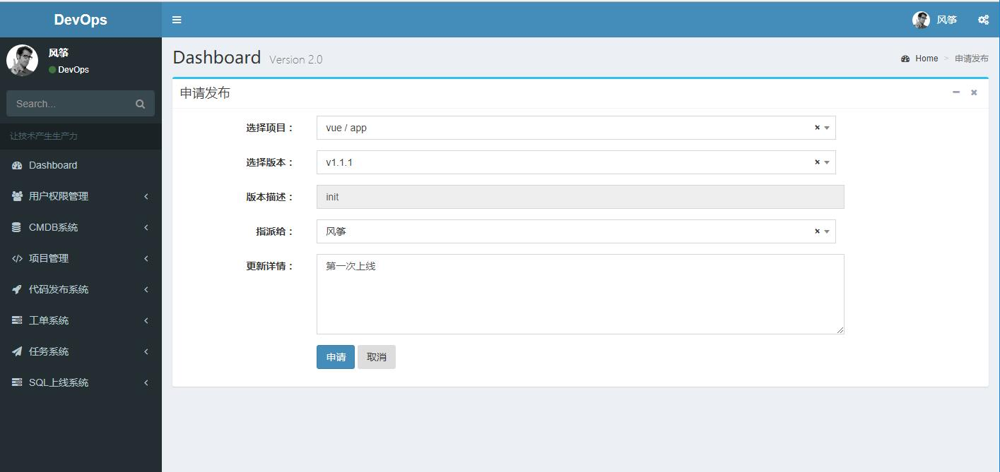
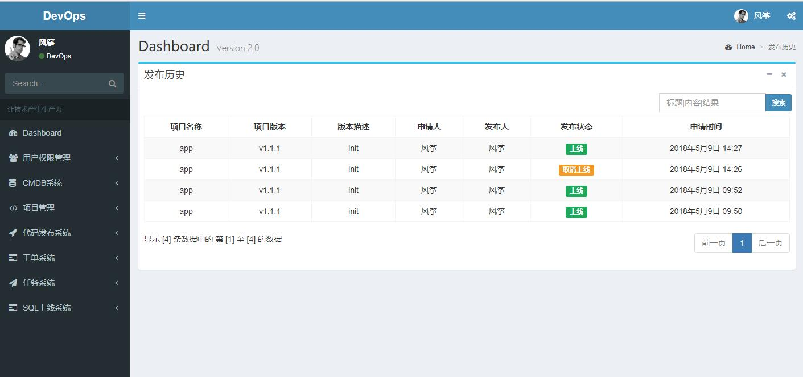
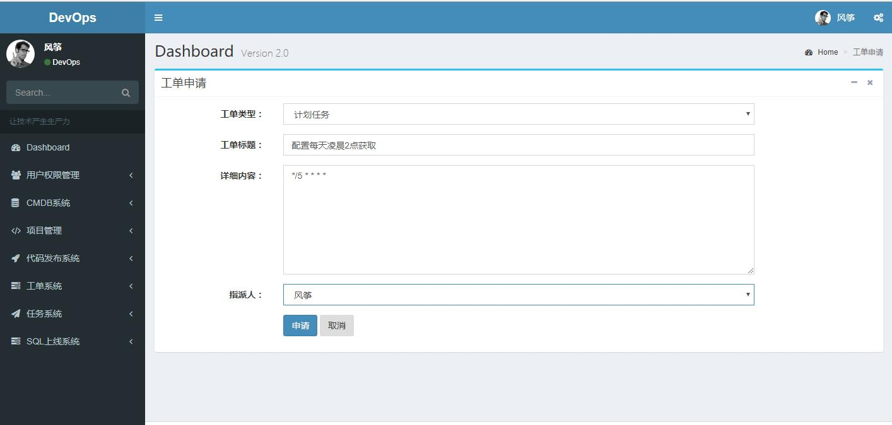
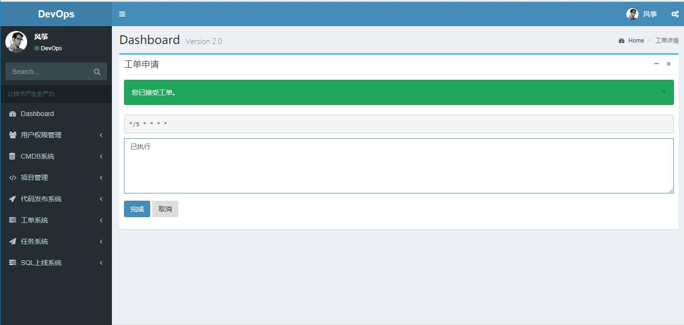

# opsweb

----

### 功能
  - 认证授权
  - 双因子认证
  - 资产管理 
  - 业务线管理 
  - 项目管理 
  - 工单系统 
  - 代码发布 
  - 任务系统 
  - 数据大盘 
  - SQL审核上线

### 开始使用
#### 前期准备
  - Mysql
  - Redis
  - Celery
  - Gitlab
  - Jenkins
  - Ansible
  - Aliyun/QCloud SDK
#### 项目简图
1. 登录界面

2. 首页

3. 用户管理

4. 权限管理

5. CMDB资产

6. CMDB业务线

7. 项目管理

8. 发布申请

9. 发布历史

10. 工单申请

11. 工单处理

#### 备份一下省的丢失，后续继续完善。
